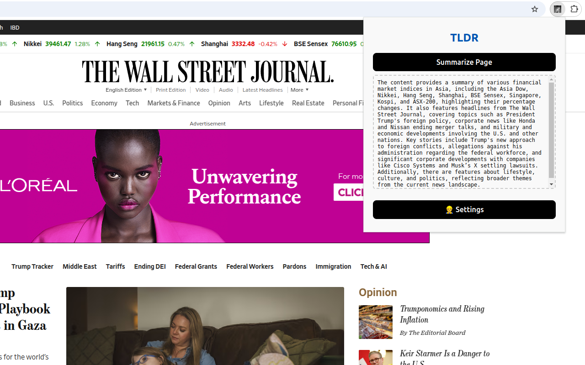

# tldr: Browse the web faster than ever


Get the Chrome extension at [Chrome Web Store](https://chromewebstore.google.com/detail/tldr/aljfihkaeagceadlaimgmihkcngifngh)!

## Why TLDR?

**TLDR** turbocharges your web browsing experience

## Features

- AI-powered web page summarization

## Screenshots



## Getting Started

### Prerequisites

Make sure you have [Node.js](https://nodejs.org/) (version 18+ or 20+) installed on your machine.

### Setup

1. Install the dependencies:

   ```sh
   pnpm install
   ```

## 🏗️ Development

To start the development server:

```sh
pnpm run dev
```

This will start the Vite development server and open your default browser.

## 📦 Build

To create a production build:

```sh
pnpm run build
```

This will generate the build files in the `build` directory.

## 📂 Load Extension in Chrome

1. Open Chrome and navigate to `chrome://extensions/`.
2. Enable "Developer mode" using the toggle switch in the top right corner.
3. Click "Load unpacked" and select the `build` directory.

Your React app should now be loaded as a Chrome extension!

## 🗂️ Project Structure

- `public/`: Contains static files and the `manifest.json`.
- `src/`: Contains the React app source code.
- `vite.config.ts`: Vite configuration file.
- `tsconfig.json`: TypeScript configuration file.
- `package.json`: Contains the project dependencies and scripts.

